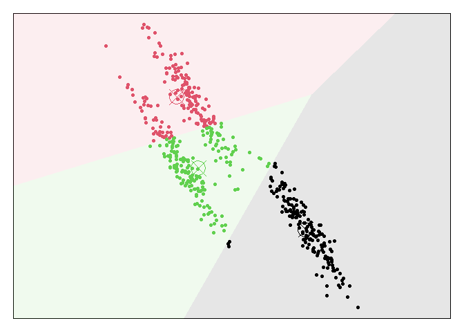
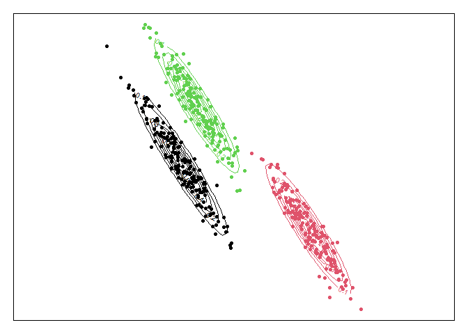

<!-- README.md is generated from README.Rmd. Please edit that file -->

# `{r, include = FALSE} # knitr::opts_chunk$set( #   collapse = TRUE, #   comment = "#>", #   fig.path = "man/figures/README-", #   out.width = "100%" # ) #`

# clustlearn

<!-- badges: start -->
<!-- badges: end -->

The goal of clustlearn is to provide a set of functions to perform
clustering analysis along with comprehensive explanations of the
algorithms, their pros and cons, and their applications.

## Installation

You can install the development version of clustlearn from
[GitHub](https://github.com/) with:

``` r
# install.packages("devtools")
devtools::install_github("Ediu3095/clustlearn")
```

You can install the released version of clustlearn from
[CRAN](https://CRAN.R-project.org) with:

``` r
install.packages("clustlearn")
```

## Example

This is a basic example which shows you how to solve a common problem:

``` r
library(clustlearn)
```

    ## 
    ## Attaching package: 'clustlearn'

    ## The following object is masked from 'package:stats':
    ## 
    ##     kmeans

``` r
data <- clustlearn::db4
cols <- c("#00000019", "#DF536B19", "#61D04F19", "#2297E619", "#28E2E519", "#CD0BBC19", "#F5C71019", "#9e9e9e19")
k <- 3

# VONOROI DIAGRAM
library(deldir)
```

    ## deldir 1.0-9      Nickname: "Partial Distinction"

    ## 
    ##      The syntax of deldir() has changed since version 
    ##      0.0-10.  In particular the "dummy points" facility 
    ##      (which was a historical artifact) has been removed. 
    ##      In the current version, 1.0-8, an argument "id" has 
    ##      been added to deldir().  This new argument permits the 
    ##      user to specifier identifiers for points.  The default 
    ##      behaviour is to continue using the indices of the 
    ##      points to identify them.  In view of the fact that 
    ##      point identifiers may be user-supplied, the arguement 
    ##      "number", in plot.deldir() and plot.tile.list(), has 
    ##      had its name changed to "labelPts", and the argument 
    ##      "nex" in plot.deldir() has had its name changed to 
    ##      "lex".  In addition the name of the forth component 
    ##      of the "cmpnt_col" argument in plot.deldir() has been 
    ##      changed from "num" to "labels".  There is a new 
    ##      function getNbrs(), and the function tileInfo() has 
    ##      been modified to include output from getNbrs(). 
    ##      Please consult the help.

``` r
members <- kmeans(data, k, 100)

tesselation <- deldir(members$centers[, 1], members$centers[, 2], rw = c(-10, 10, -10, 10))
tiles <- tile.list(tesselation)

par(mar = c(1, 1, 1, 1))
plot(data, col = members$cluster, main = '', sub = '', xlab = '', ylab = '', asp = 1, frame.plot = TRUE, axes = FALSE, pch = 20)
points(members$centers, col = seq_len(k), pch = 13, cex = 3)
plot(tiles, main = '', sub = '', xlab = '', ylab = '', asp = 1, frame.plot = TRUE, axes = FALSE, pch = 19, add = TRUE, showpoints = FALSE, border = "#ffffff00", fillcol = cols)
```

<!-- -->

``` r
# NORMAL DISTRIBUTION
members <- gaussian_mixture(data, k, 100)
mu <- members$mu
sigma <- members$sigma
lambda <- members$lambda

x <- seq(-3, 3, 0.1) 
y <- seq(-3, 3, 0.1)

par(mar = c(1, 1, 1, 1))
plot(data, col = members$cluster, main = '', sub = '', xlab = '', ylab = '', asp = 1, frame.plot = TRUE, axes = FALSE, pch = 20)
for (i in seq_len(k)) {
  m <- mu[i, ]
  s <- sigma[i, , ]
  f <- function(x, y) lambda[i] * clustlearn:::dmnorm(cbind(x, y), m, s)
  z <- outer(x, y, f)
  contour(x, y, z, col = i, add = TRUE)
}
```

<!-- -->

``` r
# DENSITY
plot(data, col = (dbscan(data, .25, 5)$cluster + 3) %% 4 + 1, main = '', sub = '', xlab = '', ylab = '', asp = 1, frame.plot = TRUE, axes = FALSE, pch = 20)
```

<!-- -->

<!-- You'll still need to render `README.Rmd` regularly, to keep `README.md` up-to-date. `devtools::build_readme()` is handy for this. You could also use GitHub Actions to re-render `README.Rmd` every time you push. An example workflow can be found here: <https://github.com/r-lib/actions/tree/v1/examples>. -->
